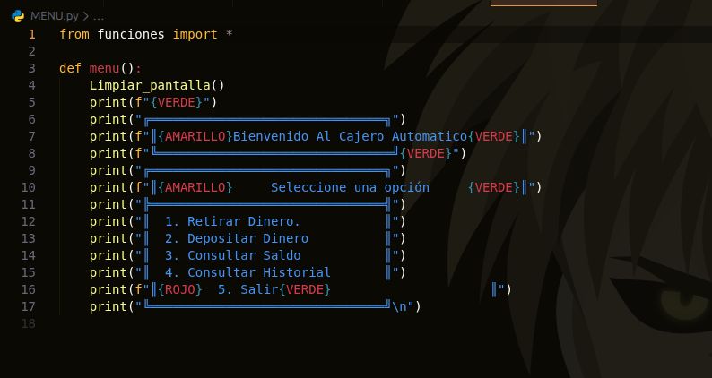
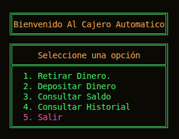

#  **Simulador de cajero automático**

## _Descripción del proyecto_

Este proyecto consiste en la elaboración de un cajero automático haciendo uso de herramientas como Python, Git y GitHub.

El simulador permite a los usuarios realizar funciones como:
 1. Consultar saldo 
 2. Crear una nueva cuenta de usuario
 2. retirar/depositar saldo  
 3. salir del programa. 
 
 Esto, teniendo en cuenta la aplicación de las reglas de negociación y las validaciones específicas en lo que respecta a la entrada de números.

## _Objetivo_

Poner en práctica habilidades como:

1. Trabajo colaborativo: Ya que, se hizo uso de GitHub y Trello.

2. Validación de datos.

3. Validación de reglas de negociación.

## _Funcionalidades_

El proyecto "Simulador de cajero automático" cumple con las siguientes funciones:

1. Muestra un mensaje de bienvenida.
2. Solicita autenticación al usuario.
3. Si el usuario no tiene una cuenta, el programa le permite crear una
3. Valida intentos.
4. Le indica al usuario cuántas operaciones quiere realizar.
5. Muestra el menú por cada operación que el usuario realice
6. Ejecuta la acción que se le indique.
7. Valida las reglas de negociación.
8. Finaliza cuando el usuario le indique o cuando termine de ejecutar una operación.
9. Muestra un mensaje final de agradecimiento.

## _Reglas de negociación_

1. El sistema inicia con un saldo fijo de $1000
2. El usuario se autentica con un pin 
3. El usuario tiene un límite de intentos
4. El sistema realiza bien sus funciones
5. No permite montos negativos
6. No permite retiros mayores al saldo disponible
7. Cuando finaliza muestra un mesaje de despedida
8. El sistema se ejecuta desde un archivo llamado main.py

## _Ejemplo del menú del sistema_

A continuación, se muestra el menú del programa

## _Menú en ejecución_
 A continuación, se muestra el menú en estado de ejecución:

## _Flujo del programa_

El simulador de cajero automático funciona siguiendo el siguiente flujo:

1. Muestra el mensaje de bienvenida
2. Solicita la autentación del usuario 
3. Permite crear una nueva cuenta si el usuario no tiene una 
3. Valida los intentos de acceso
4. Muestra el menú de opciones
5. Permite elegir una opción 
6. Valida las reglas de negocio 
7. Realiza la operación seleccionada
8. Finaliza cuando el usurio elija salir

## _Mensaje final del programa_

Cuando el usuario termina las operaciones en el programa, este mismo muestra:

"Gracias por usar el cajero"

## _Autores_

Este proyecto fue desarrollado por:

1. _Nestor Duran_
2. _Isac Álvarez_
3. _Maryuris Aragón_

